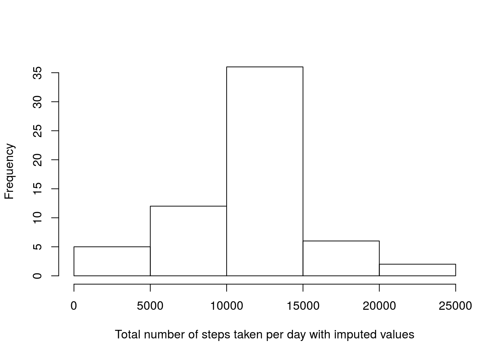

## Loading and preprocessing the data

```r
#Load the data:
data<-read.csv("activity.csv")
#Convert the date strings into date objects:
data$date<-as.POSIXct(data$date,"%Y-%m-%d")
```

## What is mean total number of steps taken per day?

```r
#The total number of steps taken per day:
totalSteps<-aggregate(data$steps,by=list(data$date),FUN=sum,na.rm=TRUE)
head(totalSteps)
```

```
##      Group.1     x
## 1 2012-10-01     0
## 2 2012-10-02   126
## 3 2012-10-03 11352
## 4 2012-10-04 12116
## 5 2012-10-05 13294
## 6 2012-10-06 15420
```

```r
#A histogram of the total number of steps taken each day:
hist(totalSteps$x,xlab="Total number of steps taken per day",main="")
```


```r
#The mean and median of the total number of steps taken per day:
mean(totalSteps$x)
```

```
## [1] 9354.23
```

```r
median(totalSteps$x)
```

```
## [1] 10395
```

## What is the average daily activity pattern?

```r
#The average number of steps taken in each interval, averaged across all days:
averageSteps<-aggregate(data$steps,by=list(data$interval),FUN=mean,na.rm=TRUE)
#Rename the columns:
colnames(averageSteps)=c("interval","count")
#A time series plot:
plot(averageSteps$interval,averageSteps$count,type="l",xlab="Interval",ylab="Average number of steps")
```


```r
#The interval that, on average across all the days in the dataset, contains the maximum number of steps:
averageSteps$interval[averageSteps$count==max(averageSteps$count)]
```

```
## [1] 835
```

## Imputing missing values

```r
#The total number of missing values in the dataset:
sum(is.na(data$steps) | is.na(data$date) | is.na(data$interval))
```

```
## [1] 2304
```

```r
#The missing values appear only in the step counts:
sum(is.na(data$date) | is.na(data$interval))
```

```
## [1] 0
```

```r
#A new dataset that is equal to the original dataset but with the missing data filled in by using the mean for that 5-minute interval:
newData<-data
for(i in 1:nrow(data))
{
  if(is.na(newData$steps[i]))
{
    newData$steps[i]<-averageSteps[averageSteps$interval==newData$interval[i],2]
  }
}
#The total number of steps taken each day:
totalStepsImp<-aggregate(newData$steps,by=list(newData$date),FUN=sum,na.rm=TRUE)
#A histogram of this:
hist(totalStepsImp$x,xlab="Total number of steps taken per day with imputed values",main="")
```



```r
#The mean and median total number of steps taken per day with the imputed missing values:
mean(totalStepsImp$x)
```

```
## [1] 10766.19
```

```r
median(totalStepsImp$x)
```

```
## [1] 10766.19
```
The mean and median are larger with the data with imputed missing values than with the data with removed missing values.

## Are there differences in activity patterns between weekdays and weekends?

```r
#Create new factor variable in the dataset with two levels – “weekday” and “weekend” indicating whether a given date is a weekday or weekend day:
dayType<-factor(ifelse(weekdays(newData$date)=="Sunday" | weekdays(newData$date)=="Saturday", "weekend", "weekday"))
newData<-cbind(newData,dayType)
#A panel plot of the 5-minute interval and the average number of steps taken, averaged across all weekday days or weekend days:
averageStepsPerDayType<-aggregate(newData$steps,by=list(newData$interval,newData$dayType),FUN=mean,na.rm=TRUE)
colnames(averageStepsPerDayType)<-c("interval","dayType","steps")
library(ggplot2)
qplot(y=steps,x=interval,data=averageStepsPerDayType,facets=.~dayType)+
  geom_line(col="black")+
  geom_point(col="blue",size = 2)+
  labs(x="Interval")+
  labs(y="Average number of steps")
```


